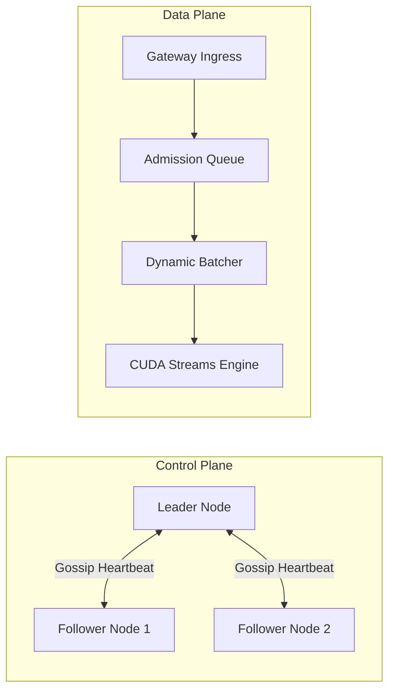

# System Architecture - InferX

This document describes the architectural layout of the **InferX** distributed inference platform.

---

## 1. High-Level Architecture

InferX is divided into two operational planes:
1.  **Control Plane (Distributed Runtime):** Manages cluster topologies, registers node liveness states, elects a leader node via Raft-inspired consensus, and replicates configurations.
2.  **Data Plane (Execution Engine):** Routes requests, prioritizes admission queues, batches tensor workloads, and manages local GPU memory and CUDA execution streams.

---

## 2. Distributed Control Plane

The Control Plane coordinates nodes across the cluster:
*   **Consensus Leader Election:** Staggers startup loop timers to elect a coordinator node. Heartbeats ensure follower nodes reset election leases.
*   **Gossip Failure Detector:** Uses inter-node ping/pong RPC protocols to register nodes. Nodes failing to respond within 2.0s are marked `DOWN`.
*   **State Replication:** The elected Leader propagates configuration key/value entries dynamically to all follower nodes.

---

## 3. Data Plane & Task Execution

Workload scheduling and hardware mapping use the following pipeline:
1.  **Admission Queue:** Requests are verified, rated, and placed in a priority queue.
2.  **Distributed Scheduler:** If local CPU/GPU utilization limits are exceeded, requests are routed to the least loaded remote node hosting the target model.
3.  **Dynamic Batcher:** Collects pending requests into a single tensor block, maximizing GPU utilization.
4.  **CUDA Streams Manager:** Allocates unique streams to isolate execution and prevent model contention.

---

## 4. Observability & Profiling

*   **Prometheus Exporter:** Pulls metrics for counters, gauges, and histograms.
*   **OpenTelemetry Tracing:** Spans context var propagation tracks requests across nodes.
*   **Execution Timeline Profiler:** Tracks milestones from gateway arrival to token dispatch.
*   **AlertManager:** Monitors metrics and triggers notifications on error spikes.
