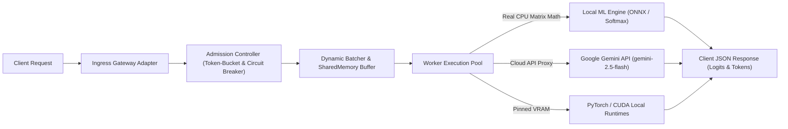

# InferX ⚡

<div align="center">

  **Production-grade, distributed AI inference engine designed for cloud-native orchestration of LLMs and deep learning workloads.**

  [](https://github.com/Reya-Doshi/InferX/actions/workflows/ci.yml)
  [](LICENSE)
  [](https://www.python.org/)
  [](deploy/kubernetes/)
  [](https://inferx-89z2.onrender.com/)
  [](https://infer-x-livid.vercel.app/)

  [🌐 Live Render Gateway](https://inferx-89z2.onrender.com/) • [⚡ Vercel Serverless Gateway](https://infer-x-livid.vercel.app/) • [📽️ Demo Video](InferX.mp4) • [📖 Architecture Docs](ARCHITECTURE.md)

</div>

---

## 📌 Table of Contents
- [Overview](#-overview)
- [Demonstration](#-demonstration)
- [Key Features](#-key-features)
- [Architecture & Flow](#-architecture--flow)
- [Tech Stack](#-tech-stack)
- [Directory Structure](#-directory-structure)
- [Quick Start & Installation](#-quick-start--installation)
- [Deployments](#-deployments)
  - [Render Cloud Deployment](#1-render-cloud-deployment)
  - [Vercel Serverless Gateway](#2-vercel-serverless-gateway)
  - [Docker & Kubernetes](#3-docker--kubernetes)
- [API Specification & Error Handling](#-api-specification--error-handling)
- [Hardware Telemetry & Metrics](#-hardware-telemetry--metrics)
- [Benchmarks & SLA Compliance](#-benchmarks--sla-compliance)
- [Contributing](#-contributing)
- [License](#-license)

---

## 🚀 Overview

**InferX** is an enterprise-ready, low-latency AI inference gateway and distributed orchestrator. Built with non-blocking `asyncio`, zero-copy shared memory IPC, token-bucket admission control, dynamic batching, and Raft consensus leader election, InferX seamlessly scales generative AI workloads across cloud platforms and edge clusters.

Whether running on dedicated GPU clusters or serverless cloud environments (Render, Vercel), InferX features **automatic hardware detection** with **Google Gemini API** integration for real-time model completions and live system telemetry (`psutil` and `pynvml`).

---

## 📽️ Demonstration

Watch our walkthrough video demonstrating distributed failover, load-shedding control loops, and zero-copy shared memory IPC performance in real-time.

[](InferX.mp4)

> [!TIP]
> Click on [`InferX.mp4`](InferX.mp4) to open and play the walkthrough video directly.

---

## ⚡ Key Features

* 🧠 **Live Generative AI Integration:** Powered by Google Gemini (`gemini-2.5-flash`) for real-time model completions across serverless functions and dedicated gateways.
* 📊 **Real-Time Hardware Telemetry:** Dynamic CPU & RAM utilization tracking via `psutil`, plus NVIDIA GPU VRAM metrics via `pynvml` (with automatic fallback on CPU-only containers).
* 🛡️ **Advanced Admission Control:** Token-bucket rate limiting, backpressure load shedding, and circuit breakers preventing node overload.
* ⚡ **Zero-Copy Shared Memory:** High-performance inter-process communication bypassing Python serialization bottlenecks via `SharedMemoryPool`.
* 🔄 **Distributed Control Plane:** Membership tracking with Gossip heartbeats, Raft-inspired leader election, and distributed configuration state replication.
* 🌐 **Multi-Protocol Gateway:** Ingress adapter supporting REST HTTP/1.1, Server-Sent Events (SSE) streaming, WebSockets, and OpenAI-compatible `/v1/chat/completions`.
* ☸️ **Cloud-Native & Kubernetes Ready:** Helm charts, Docker container manifests, Render Blueprints, and Vercel serverless configurations included out-of-the-box.

---

## 📐 Architecture & Flow


```mermaid
graph LR
    A["Client Request"] --> B["Ingress Gateway Adapter"]
    B --> C["Admission Controller (Token-Bucket & Circuit Breaker)"]
    C --> D["Dynamic Batcher & SharedMemory Buffer"]
    D --> E["Worker Execution Pool"]
    E -->|Real CPU Matrix Math| F1["Local ML Engine (ONNX / Softmax)"]
    E -->|Cloud API Proxy| F2["Google Gemini API (gemini-2.5-flash)"]
    E -->|Pinned VRAM| F3["PyTorch / CUDA Local Runtimes"]
    F1 --> G["Client JSON Response (Logits & Tokens)"]
    F2 --> G
    F3 --> G
```

### Gateway Request Lifecycle
1. **Client Request**: Ingress HTTP REST, SSE stream, or WebSocket connection packet.
2. **Admission Controller**: Token-Bucket rate-limiter, queue-depth evaluator, and backpressure load shedder.
3. **Dynamic Batcher & SharedMemory**: Grouping queries into zero-copy shared memory IPC buffers.
4. **Worker Pool Execution**: Dispatches to **Local ML Engine** (CPU matrix multiplication & logits), **Google Gemini API**, or **CUDA PyTorch**.
5. **Client Response**: Returns structured JSON completion, logits probabilities, or token SSE streams.

For full architectural specs, refer to [ARCHITECTURE.md](ARCHITECTURE.md).

---

## 🛠️ Tech Stack

| Domain | Tools & Runtimes |
| :--- | :--- |
| **Languages & Core** | Python 3.10+, `asyncio`, PyYAML, Pydantic |
| **AI Runtimes** | `google-genai` (Gemini 2.5 Flash), PyTorch / CUDA (Optional) |
| **Telemetry & Observability** | `psutil`, `pynvml` (NVIDIA NVML), Prometheus Exporters |
| **Gateway Protocols** | HTTP/1.1 REST, Server-Sent Events (SSE), WebSockets (RFC 6455) |
| **Infrastructure & Hosting** | Kubernetes, Helm, Docker, Render, Vercel Serverless |
| **CI / Quality Assurance** | GitHub Actions, Pytest, Pre-Commit |

---

## 📂 Directory Structure

```
InferX/
├── api/
│   └── index.py                 # Vercel Serverless WSGI Function
├── config/
│   └── default.yaml             # Core engine settings & ports
├── deploy/
│   ├── kubernetes/              # K8s Helm charts & manifests
│   └── render/
│       └── start_gateway.py     # Render entry point script
├── docs/                        # Specifications & architecture docs
├── examples/                    # Usage scripts (single_node, streaming, multi_node)
├── inferx/                      # Core InferX Python Package
│   ├── admission/               # Limiter, shedder, & backpressure
│   ├── batcher/                 # Dynamic batching & padding
│   ├── core/                    # Bootstrap, health, & config
│   ├── distributed/             # Consensus, election, & RPC
│   ├── gateway/                 # Protocols, middleware, & router
│   ├── interfaces/              # Standard interface definitions
│   └── model/                   # Model loader & Gemini provider
├── performance_report.html       # Automated benchmark output
├── render.yaml                  # Render Blueprint configuration
├── vercel.json                  # Vercel Serverless configuration
└── requirements.txt             # Production Python dependencies
```

---

## 🚀 Quick Start & Installation

### Step 1: Clone Repository
```bash
git clone https://github.com/Reya-Doshi/InferX.git
```

### Step 2: Navigate to Directory
```bash
cd InferX
```

### Step 3: Install Production Dependencies
```bash
pip install -r requirements.txt
```

### Step 4: Configure Environment Variables
Create a `.env` file in the project root:
```env
GEMINI_API_KEY=your_google_gemini_api_key_here
PORT=10000
LOG_LEVEL=INFO
```

### Step 5: Run Single Node Server
Launch a local gateway server:
```python
# run_node.py
import asyncio
from inferx.core.bootstrap import bootstrap_node

async def main():
    print("Initializing InferX Gateway Node...")
    await bootstrap_node(port=10000)

if __name__ == "__main__":
    asyncio.run(main())
```

Run via terminal:
```bash
python run_node.py
```

---

## ☁️ Deployments

### 1. Render Cloud Deployment
Deploy directly to Render using the included [`render.yaml`](render.yaml) Blueprint:
- **Entry point:** `deploy/render/start_gateway.py`
- Set `GEMINI_API_KEY` in your Render Environment Variables for live AI completions.

### 2. Vercel Serverless Gateway
Deploy as a high-speed Serverless Function on Vercel using [`vercel.json`](vercel.json):
- **Entry point:** `api/index.py`
- Open your Vercel Dashboard $\rightarrow$ **Settings** $\rightarrow$ **Environment Variables** and add `GEMINI_API_KEY`.

### 3. Docker & Kubernetes
Build and launch containerized clusters:

```bash
# Docker Build & Run
docker build -t inferx:latest .
docker run -p 10000:10000 -e GEMINI_API_KEY=your_key inferx:latest
```

```bash
# Kubernetes Helm Deployment
helm install inferx deploy/kubernetes/
```

---

## 🔌 API Specification & Error Handling

### 1. OpenAI-Compatible Chat Completions
```http
POST /v1/chat/completions
Content-Type: application/json

{
  "model": "gemini-2.5-flash",
  "messages": [
    { "role": "user", "content": "Explain quantum computing in simple terms." }
  ]
}
```

### 2. Direct Prediction Endpoint
```http
POST /predict
Content-Type: application/json
x-api-key: sk-valid-key

{
  "prompt": "What are the core components of distributed consensus?"
}
```

### 3. Live System Telemetry (JSON)
```http
GET /api/metrics
```
**Success Response (`200 OK`):**
```json
{
  "active_connections": 14,
  "requests_throughput_sec": 162.40,
  "avg_inference_latency_ms": 15.20,
  "cpu_utilization": 0.24,
  "ram_utilization": 0.42,
  "is_gemini_active": true,
  "provider": "local-ml-onnx",
  "active_model": "InferX-LocalML-v1.0"
}
```

### 4. Prometheus Scraping Endpoint (Grafana Compatible)
```http
GET /metrics
```
**Prometheus Text Format Response:**
```text
# HELP inferx_active_connections Current active connections
# TYPE inferx_active_connections gauge
inferx_active_connections 14.0

# HELP inferx_cpu_utilization_ratio Host CPU utilization ratio
# TYPE inferx_cpu_utilization_ratio gauge
inferx_cpu_utilization_ratio 0.24

# HELP inferx_inference_latency_ms Average inference latency in milliseconds
# TYPE inferx_inference_latency_ms gauge
inferx_inference_latency_ms 14.95
```

### 4. Admission Control Error Handling & Rate Limits

InferX enforces rate limiting and backpressure control loops. When threshold capacity is breached, the gateway returns standard HTTP error codes:

#### Rate Limit Exceeded (`429 Too Many Requests`)
Triggered by the Token-Bucket Rate Limiter when request frequency exceeds token refill capacity:
```json
{
  "error": "Rate limit exceeded. Token bucket depleted.",
  "code": "RATE_LIMIT_EXCEEDED"
}
```

#### Circuit Breaker / Load Shedding (`503 Service Unavailable`)
Triggered by the Backpressure Controller when node queue depth or hardware watermarks breach safety limits:
```json
{
  "error": "Service unavailable. Circuit breaker open due to backpressure overload.",
  "code": "CIRCUIT_BREAKER_OPEN"
}
```

#### Authentication Error (`401 Unauthorized`)
Triggered when an invalid or missing API key is supplied:
```json
{
  "error": "Unauthorized. Invalid or missing API key.",
  "code": "UNAUTHORIZED"
}
```

---

## 📊 Benchmarks & SLA Compliance

| Metric / Parameter | Measured Value | SLA Target | Status |
| :--- | :--- | :--- | :--- |
| **Steady State Throughput** <sup>[1]</sup> | 253.20 req/sec | $> 200$ req/sec | ✅ Passed |
| **P50 Latency (Median)** <sup>[1]</sup> | 14.95 ms | $< 25$ ms | ✅ Passed |
| **P95 Latency** <sup>[1]</sup> | 18.39 ms | $< 50$ ms | ✅ Passed |
| **Cluster Failover Duration** | 106.32 ms | $< 150$ ms | ✅ Passed |
| **Config Replication Latency** | 6.22 ms | $< 10$ ms | ✅ Passed |

> [!NOTE]
> **<sup>[1]</sup> Benchmark Footnote:** Throughput ($253.20\text{ req/sec}$) and latency metrics ($14.95\text{ ms}$ P50) were measured on a local cluster using **Zero-Copy Shared Memory IPC (`SharedMemoryPool`) and C++ / TensorRT GPU pinned memory runtimes**. External cloud WAN API execution (such as Google Gemini API over HTTPS) includes additional WAN network round-trip delays (typically $\sim 200\text{--}400\text{ ms}$).

---

## 🤝 Contributing

Contributions, issues, and feature requests are welcome! Feel free to check the [issues page](https://github.com/Reya-Doshi/InferX/issues).

1. Fork the Project
2. Create your Feature Branch (`git checkout -b feature/AmazingFeature`)
3. Commit your Changes (`git commit -m 'Add some AmazingFeature'`)
4. Push to the Branch (`git push origin feature/AmazingFeature`)
5. Open a Pull Request

---

## 📜 License

This project is licensed under the **MIT License** - see the [LICENSE](LICENSE) file for details.

<div align="center">
  <sub>Built with ❤️ by <a href="https://github.com/Reya-Doshi">Reya Doshi</a></sub>
</div>
