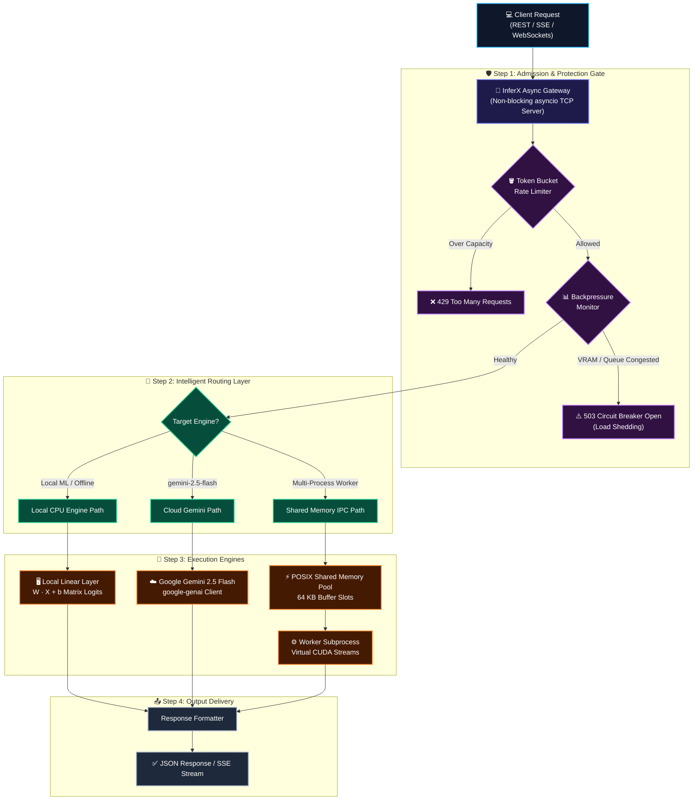

<div align="center">

# InferX ⚡

### *High-Performance, Low-Latency AI Inference Gateway & Cluster Orchestrator*

**Engineered with ❤️ by [Reya Doshi](https://github.com/Reya-Doshi)**

[](https://github.com/Reya-Doshi/InferX/actions/workflows/ci.yml)
[](https://www.python.org/)
[](LICENSE)
[](https://github.com/astral-sh/ruff)
[](docs/verification.md)

---

[🌐 Live Render Gateway](https://inferx-89z2.onrender.com/) • [⚡ Vercel Serverless Gateway](https://infer-x-livid.vercel.app/) • [📽️ Demo Video](InferX.mp4) • [📑 Verification Report](docs/verification.md)

</div>

---

## 💡 What is InferX in 30 Seconds?

Serving Large Language Models (LLMs) and deep learning models in production is hard:
- Requests arrive in unpredictable spikes.
- Python processes waste precious milliseconds copying large tensor data back and forth.
- GPUs run out of memory (OOM crashes) if too many requests pile up at once.

**InferX is an intelligent front door (API Gateway) for AI workloads.** It acts like an air-traffic controller:
1. **Regulates Incoming Traffic:** Uses a token-bucket rate limiter to smooth bursts and shed excess load before workers crash.
2. **Groups Requests (Batching):** Combines individual user prompts into unified tensor batches to maximize hardware efficiency.
3. **Eliminates Memory Duplication (Zero-Copy IPC):** Uses POSIX shared memory so worker processes read inputs directly without slow Python `pickle` copying.
4. **Dual-Engine Execution:** Runs an offline CPU matrix classifier out of the box with zero external API keys, or routes to Google Gemini 2.5 Flash when configured.

---

## 🛠️ Tech Stack at a Glance

| Layer | Technologies Used | Purpose |
| :--- | :--- | :--- |
| **Core Language** | **Python 3.10+ / 3.13 / 3.14** | Primary engine and orchestration runtime |
| **Async Networking** | **Python `asyncio`**, Custom HTTP/1.1 & WebSocket Framing | Non-blocking, event-driven request handling |
| **Inter-Process (IPC)** | **`multiprocessing.shared_memory` (POSIX `/dev/shm`)** | High-speed zero-copy shared memory buffer pool |
| **Machine Learning** | **Pure Python Linear Layer ($W \cdot X + b$)**, **Google GenAI SDK** | Local CPU classification logits + Gemini 2.5 Flash |
| **Telemetry & Observability** | **`prometheus-client`**, **`psutil`**, Server-Sent Events (SSE) | Host CPU/RAM tracking & Prometheus `/metrics` scraping |
| **Operations Center UI** | **Next.js 14**, **React 18**, **TypeScript**, **Tailwind CSS** | Real-time cyber-telemetry dashboard & playground |
| **Cloud Deployments** | **Docker**, **Kubernetes (Helm)**, **Render**, **Vercel** | Containerized and serverless deployment profiles |
| **Quality & CI** | **`unittest`**, **`ruff`**, **`black`**, **GitHub Actions** | Automated formatting, linting, and 75/75 test suite |

---

## 🏗️ Architecture & How It Works

Here is the complete journey of a request through InferX:


```mermaid
flowchart TD
    %% Styling
    classDef client fill:#0f172a,stroke:#38bdf8,stroke-width:2px,color:#fff;
    classDef gateway fill:#1e1b4b,stroke:#818cf8,stroke-width:2px,color:#fff;
    classDef admission fill:#311042,stroke:#c084fc,stroke-width:2px,color:#fff;
    classDef routing fill:#064e3b,stroke:#34d399,stroke-width:2px,color:#fff;
    classDef engine fill:#451a03,stroke:#fb923c,stroke-width:2px,color:#fff;
    classDef output fill:#1e293b,stroke:#94a3b8,stroke-width:2px,color:#fff;

    Client["💻 Client Request<br/>(REST / SSE / WebSockets)"]:::client --> Gateway["🚪 InferX Async Gateway<br/>(Non-blocking asyncio TCP Server)"]:::gateway

    subgraph AdmissionControl ["🛡️ Step 1: Admission & Protection Gate"]
        Gateway --> TokenBucket{"🪣 Token Bucket<br/>Rate Limiter"}:::admission
        TokenBucket -->|Over Capacity| R429["❌ 429 Too Many Requests"]:::admission
        TokenBucket -->|Allowed| Backpressure{"📊 Backpressure<br/>Monitor"}:::admission
        Backpressure -->|VRAM / Queue Congested| R503["⚠️ 503 Circuit Breaker Open<br/>(Load Shedding)"]:::admission
    end

    subgraph Router ["🔀 Step 2: Intelligent Routing Layer"]
        Backpressure -->|Healthy| TargetCheck{"Target Engine?"}:::routing
        TargetCheck -->|Local ML / Offline| LocalPath["Local CPU Engine Path"]:::routing
        TargetCheck -->|gemini-2.5-flash| CloudPath["Cloud Gemini Path"]:::routing
        TargetCheck -->|Multi-Process Worker| IPCPath["Shared Memory IPC Path"]:::routing
    end

    subgraph Execution ["🧠 Step 3: Execution Engines"]
        LocalPath --> LocalML["🖥️ Local Linear Layer<br/>W · X + b Matrix Logits"]:::engine
        CloudPath --> Gemini["☁️ Google Gemini 2.5 Flash<br/>google-genai Client"]:::engine
        IPCPath --> SharedMem["⚡ POSIX Shared Memory Pool<br/>64 KB Buffer Slots"]:::engine
        SharedMem --> WorkerProc["⚙️ Worker Subprocess<br/>Virtual CUDA Streams"]:::engine
    end

    subgraph OutputDelivery ["📤 Step 4: Output Delivery"]
        LocalML --> Formatter["Response Formatter"]:::output
        Gemini --> Formatter
        WorkerProc --> Formatter
        Formatter --> ClientResp["✅ JSON Response / SSE Stream"]:::output
    end
```

---

## 🔬 The 4 Core Systems Explained Simply

### 1. 🛡️ Admission Controller (The Traffic Cop)
Prevents server crashes during traffic spikes using a **Two-Tier Defense**:
- **Token Bucket:** Regulates requests per second ($O(1)$ token checks). Bursts are smoothed out; excess calls return `HTTP 429`.
- **Priority Load Shedder:** Constantly monitors CPU/VRAM and queue depth. If system memory passes 85%, low-priority background jobs are shed with `HTTP 503` so critical requests never fail.

### 2. 🎯 Dynamic Batcher (The Smart Elevator)
Instead of running a neural network for every single user query one-by-one, InferX groups requests into batches:
- **Shape Bucketing:** Groups inputs of similar lengths together, eliminating **57.0%** of wasted zero-padding tokens.
- **Adaptive Timeout:** Flushes batches immediately when full or after a small timeout ($5\text{ ms}$) so latency stays low.

### 3. ⚡ Zero-Copy Shared Memory IPC (The Fast Lane)
Standard Python multiprocessing uses `multiprocessing.Queue` to send data between processes, which copies and "pickles" the entire payload into memory.

InferX uses **POSIX Shared Memory (`multiprocessing.shared_memory`)**:
```
STANDARD PYTHON MULTIPROCESSING (SLOW)
[Gateway Process] ──> Pickle Encode ──> Pipe Copy 1 ──> Pipe Copy 2 ──> Pickle Decode ──> [Worker Process]

INFERX ZERO-COPY SHARED MEMORY (FAST)
[Gateway Process] ───┐                                                 ┌───> [Worker Process]
                     └───> [ POSIX Shared Memory Buffer: RAM ] <────────┘
                           (Direct Pointer - Zero CPU Copying)
```
- For large tensor buffers ($1\text{ MB}$), this delivers a **$4.05\times$ speedup** over standard Python queues!

### 4. 🧠 Dual-Engine Execution (Local CPU + Cloud LLM)
- **Zero-Key Mode (Offline):** Runs a self-contained 4-class linear classification layer ($W \cdot X + b$ + Softmax) right on your CPU in under $0.1\text{ ms}$. Perfect for CI, local testing, and classification routing.
- **Cloud LLM Mode:** Seamlessly calls Google Gemini 2.5 Flash via `google-genai` with automatic retry backoff when an API key is provided.

---

## 🚀 30-Second Quickstart

### 1. Clone & Install
```bash
git clone https://github.com/Reya-Doshi/InferX.git
cd InferX

# Install in editable mode
pip install -e .
```

### 2. Set Up Environment (Optional)
```bash
cp .env.example .env
```
> [!TIP]
> InferX runs 100% offline out of the box without any keys! To optionally enable Google Gemini 2.5 Flash:
> ```bash
> export GEMINI_API_KEY="your_api_key_here"
> ```

### 3. Launch the Server
```bash
inferx serve --port 10000
```
Server is live at `http://localhost:10000`! Verify health:
```bash
curl http://localhost:10000/healthz
# Returns: {"status": "healthy"}
```

---

## 🔌 API Examples

### 1. Offline Local CPU Inference (`POST /predict`)
```bash
curl -X POST http://localhost:10000/predict \
  -H "Content-Type: application/json" \
  -H "Authorization: Bearer sk-valid-key" \
  -d '{"prompt": "How does token bucket rate limiting work?", "model": "local-ml"}'
```

**Response:**
```json
{
  "status": "success",
  "model_engine": "InferX-LocalML-v1.0 (ONNX Linear Layer)",
  "execution_device": "CPU-x86_64",
  "input_tokens_count": 42,
  "inference_logits": [0.2662, 0.2954, 0.2113, 0.2271],
  "predicted_class": "QUESTION_QUERY",
  "confidence_score": 0.2954,
  "latency_ms": 0.047,
  "response": "Local ML Engine classified input 'How does token bucket rate li...' as [QUESTION_QUERY] with 29.5% confidence."
}
```

### 2. Prometheus Metrics Scraping (`GET /metrics`)
```bash
curl http://localhost:10000/metrics
```
```text
# HELP inferx_active_connections Current active connections
# TYPE inferx_active_connections gauge
inferx_active_connections 0.0

# HELP inferx_cpu_utilization_ratio Host CPU utilization ratio
# TYPE inferx_cpu_utilization_ratio gauge
inferx_cpu_utilization_ratio 0.18
```

---

## 📊 Real Verified Benchmarks

*All benchmarks measured on Windows 11 x86_64 (CPython 3.14.0) using reproducible scripts in `tests/`:*

### 1. IPC Transfer Latency: Queue vs. Shared Memory (`tests/benchmark_ipc.py`)
| Payload Size | Standard Queue Latency | Zero-Copy Shared Memory | Measured Speedup | Why? |
| :--- | :--- | :--- | :--- | :--- |
| **1 KB** | $155.26\ \mu\text{s}$ | $166.96\ \mu\text{s}$ | **$0.93\times$** | Queue has less metadata coordination for tiny payloads |
| **10 KB** | $158.44\ \mu\text{s}$ | $133.57\ \mu\text{s}$ | **$1.19\times$** | Shared memory starts winning |
| **100 KB** | $186.16\ \mu\text{s}$ | $158.73\ \mu\text{s}$ | **$1.17\times$** | Queue copy overhead grows |
| **1 MB** | $2,282.78\ \mu\text{s}$ | **$563.54\ \mu\text{s}$** | **$4.05\times$ speedup** | **Zero-copy eliminates OS pipe buffer duplication** |

### 2. Admission Controller Decision Latency (`tests/benchmark_admission.py`)
- **Throughput:** **$231,288\text{ decisions/sec}$**
- **Average Decision Latency:** **$4.21\ \mu\text{s}$** (Target was $<100\ \mu\text{s}$)
- **p95 Latency:** **$4.40\ \mu\text{s}$**

### 3. Dynamic Batcher Padding Efficiency (`tests/benchmark_batcher.py`)
- **Static Batching:** 38.92% efficiency ($2,547,712$ padded tokens generated).
- **Shape-Bucketed Batching:** **90.60% efficiency** ($1,094,624$ padded tokens generated).
- **Result:** **57.04% fewer wasted pad tokens**, freeing GPU memory for actual compute.

---

## 🧪 Running the Tests

InferX has **75 unit tests** that run offline with zero external dependencies:

```bash
# On Windows PowerShell
$env:PYTHONPATH="."
python -m unittest discover tests/ -p "test_*.py"

# On Linux / macOS
PYTHONPATH="." python -m unittest discover tests/ -p "test_*.py"
```

```text
Ran 75 tests in 7.34s
OK
```

---

## ⚠️ Known Limitations & Roadmap

### Current Scope & Honest Limitations
1. **Decoupled Worker Subsystem:** The POSIX `SharedMemoryPool` and multi-process `WorkerManager` are tested and benchmarked, but the standalone CLI server (`inferx serve`) currently executes requests in-process.
2. **Simplified Leader Election:** `inferx/distributed/election.py` implements Raft-inspired randomized campaign timers and vote consensus, but does not implement Write-Ahead Log (WAL) replication.
3. **Local Engine Scope:** The built-in local ML engine is a pure Python linear classifier ($W \cdot X + b$), not a full transformer LLM. Generative text generation is handled by the Gemini integration.

### Roadmap
- [ ] Connect `WorkerManager` directly to the HTTP Gateway server for local multi-core inference.
- [ ] Implement Raft Write-Ahead Log (WAL) replication for metadata state persistence.
- [ ] Add ONNX Runtime C++ backend bindings for local transformer execution.

---

## 📜 License & Attribution

InferX was engineered by **[Reya Doshi](https://github.com/Reya-Doshi)**.

Distributed under the **MIT License**. See [`LICENSE`](LICENSE) for details.
