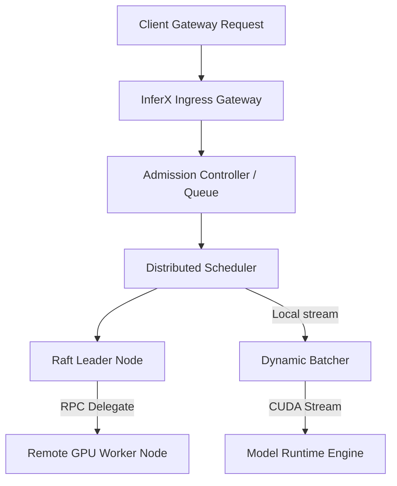

# Architecture Design - InferX

InferX separates system operations into **Control Plane** and **Data Plane** workloads to ensure isolation between cluster management and real-time tensor inference.

---

## 1. System Pipeline

---

## 2. Component Split

### 2.1 Distributed Control Plane
*   **Node Discovery:** Runs a light gossip ping loop among peers to track active cluster node metadata.
*   **Consensus Election:** Raft candidate transitions reset timer leases on leader heartbeats. Staggered campaign timers prevent split votes.
*   **State replication:** Replicates model registration configurations from the leader to all followers.

### 2.2 Execution Data Plane
*   **Admission Control:** Aging queue models prioritize deadline requests, dropping excess calls on capacity breaches.
*   **Dynamic Batching:** Combines tensor inputs into batch matrices to maximize GPU utilization.
*   **CUDA Streams Manager:** Isolates executions to separate CUDA streams to prevent thread contention.
